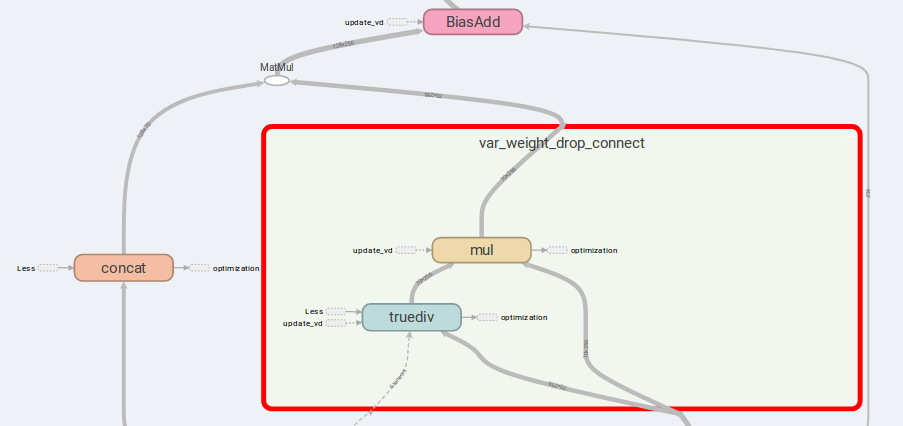
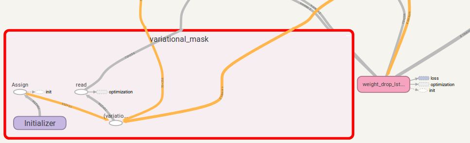

# AWD-LSTM (Weight Drop LSTM) in Tensorflow
AWD-LSTM from (["Regularizing and Optimizing LSTM Language Models"](https://arxiv.org/abs/1708.02182)) for tensorflow.

### Environment 
This code is implemmented and tested with [tensorflow](https://www.tensorflow.org/) 1.11.0. and 1.13.0.

### Usage
1. Simply initial AWD-LSTM, it's a standard [`LayerRNNCell`](https://www.tensorflow.org/api_docs/python/tf/contrib/rnn/LayerRNNCell).
```
from weight_drop_lstm import WeightDropLSTMCell

lstm_cell = WeightDropLSTMCell(
    num_units=CELL_NUM, weight_drop_kr=WEIGHT_DP_KR, 
    use_vd=True, input_size=INPUT_SIZE)
```
Arguments are define as follows:
> num_units: the number of cell in LSTM layer. [ints]\
> weight_drop_kr: the number of steps that fast weights go forward. [int]\
> use_vd: If true, using variational dropout on weight drop-connect, standard dropout otherwise. [bool]\
> input_size: If use_vd is True, input_size (dimension of last channel) should be provided. [int]

The remaining keyword arguments is exactly the same as [LSTMCell]. 

Noted that, if the weight_drop_kr is not provided or provided with 1.0, `WeightDropLSTMCell` is reducted as [`tf.nn.LSTMCell`](https://www.tensorflow.org/api_docs/python/tf/nn/rnn_cell/LSTMCell).

2. Insert update operation of dropout kernel to the place you want

```
# By simply sess.run in each training step
sess.run(lstm_cell.get_vd_update_op())

# Or use control_dependencies
vd_update_ops = lstm_cell.get_vd_update_op() 
with tf.control_dependencies(vd_update_ops):
    tf.train.AdamOptimizer(learning_rate).minimize(loss)
```

You can also add `get_vd_update_op()` to `GraphKeys.UPDATE_OPS` when calling `WeightDropLSTMCell`.

Noted that, if you use `control_dependencies`, please be careful for the order of execution.\
The variational dropout kernel should not be update before the optimizer step.


### Implementation Details

The main idea of AWD-LSTM is the drop-connect weights and concatinated inputs.
</a>

If `is_vd=True`, variables will be used to saved the dropout kernel.
</a>


#### Experimental results
I have conduct experiments on a many-to-many recursive task this implementation and carry out a better results than simple [`LSTMCell`](https://www.tensorflow.org/api_docs/python/tf/nn/rnn_cell/LSTMCell).

### Addiction: Variational dropout
I also provided a tensorflow implementation of variational dropout, which is more flexible than DropoutWrapper in tensorflow.

The usage is similar to using `WeightDropLSTMCell`:
```
from variational_dropout import VariationalDropout

vd = VariationalDropout(input_shape=[5], keep_prob=0.5)

# Directly sess.run() to update
sess.run(vd.get_update_mask_op())

# Or use control_dependencies
with tf.control_dependencies(vd.get_update_mask_op()):
    step, results_array = tf.while_loop(
        cond=lambda step, _: step < 5,
        body=main_loop,
        loop_vars=(step, results_array))
"""
    This is just a simple example. 
    Usually, control_dependencies will be placed where optimizer stepping.
"""
```

You can also add `get_update_mask_op()` to `GraphKeys.UPDATE_OPS` when calling `VariationalDropout`.

Once again, if you use `control_dependencies`, please be careful for the order of execution.\

### TO-DO
1. Provide the regulization utilities mentioned in the paper.
2. Maybe there is some elegent way to implement variational dropout.


If you have any suggestion, please let me know. I'll be pretty grateful!

### Contact & Copy Right
Code work by Jia-Yau Shiau <jiayau.shiau@gmail.com>.
